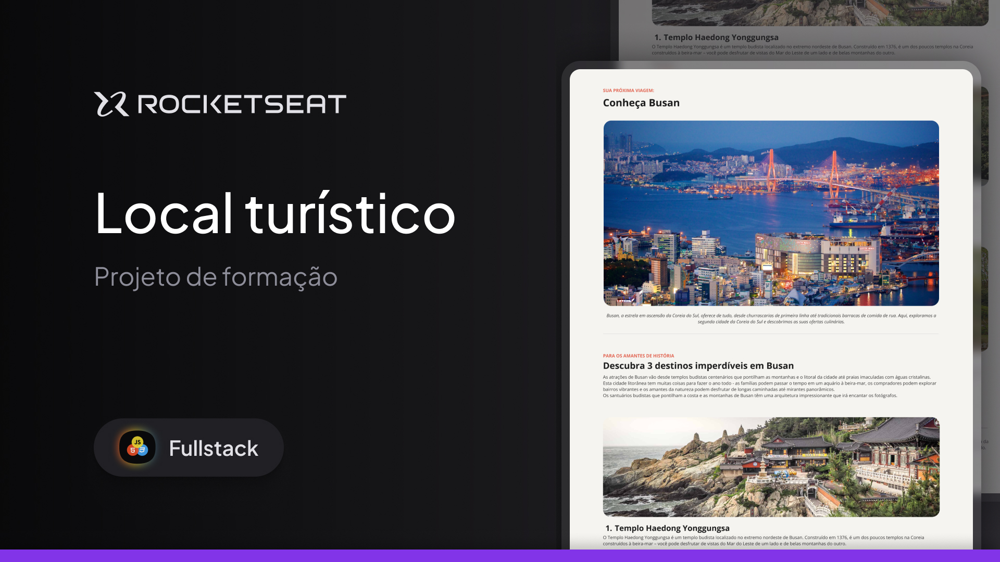

<h1 align="center"> Local Turístico </h1>

Projeto exclusivo e gratuito, promovido pela Rocketseat para ensino de tecnologias WEB.

 

  

## 🚀 Tecnologias

Esse projeto foi desenvolvido com as seguintes tecnologias:

- HTML e CSS
- Figma
- Git e Github

## 💻 Projeto

O Local Turístico é um projeto para usar como cartão de visitas online.

## 🔖 Layout

Você pode visualizar o layout do projeto através [DESSE LINK]([https://www.figma.com/community/file/1187422022288947321](https://www.figma.com/design/JocpZW0esJqLaQHW7WHJrm/Local-Tur%C3%ADstico-(Community)?node-id=915-685&node-type=frame&t=BLzI5GdFwX7NZHP4-0)). É necessário ter conta no [Figma](https://figma.com) para acessá-lo.

## :memo: Licença

Esse projeto está sob a licença MIT.

---

Feito com ♥ by Rocketseat :wave: [Participe da nossa comunidade!](https://discord.gg/rocketseat)